Pragmatics in CTSL - Norming for Feature Selection (TURKISH)
================

    ## `summarise()` regrouping output by 'img_name' (override with `.groups` argument)

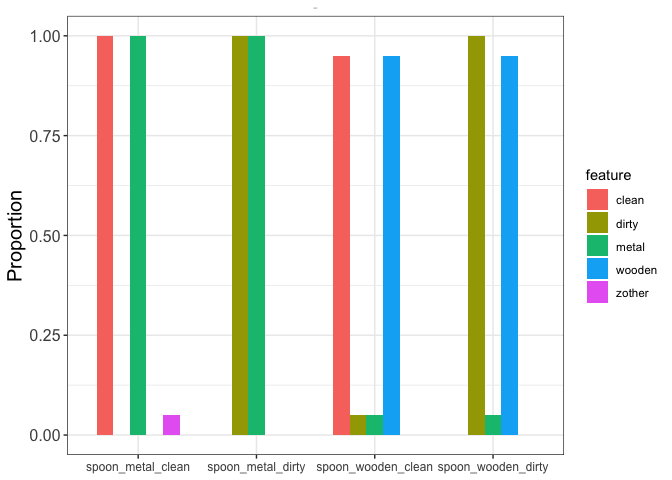<!-- -->

    ## `summarise()` regrouping output by 'img_name' (override with `.groups` argument)

<!-- -->

    ## `summarise()` regrouping output by 'img_name' (override with `.groups` argument)

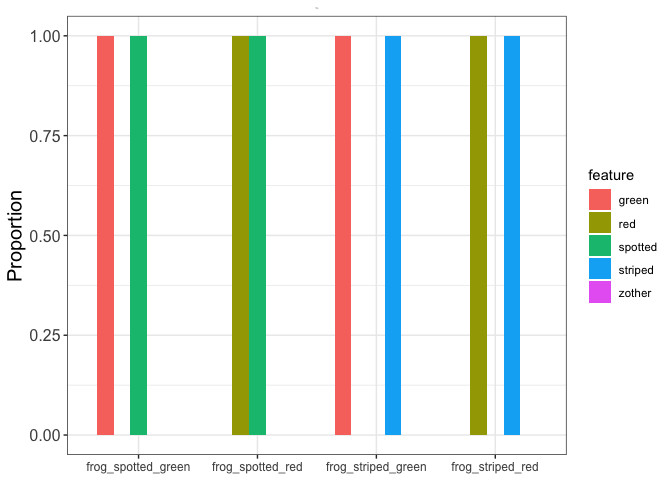<!-- -->

    ## `summarise()` regrouping output by 'img_name' (override with `.groups` argument)

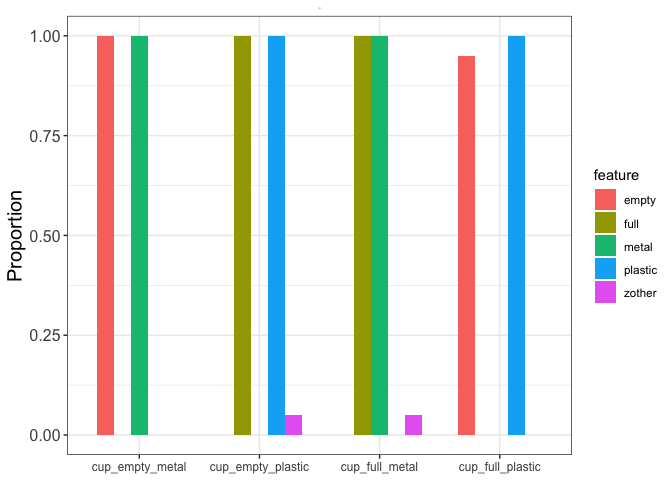<!-- -->

    ## `summarise()` regrouping output by 'img_name' (override with `.groups` argument)

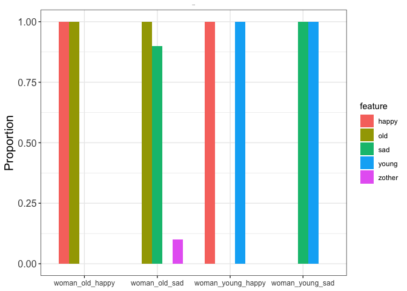<!-- -->

    ## `summarise()` regrouping output by 'img_name' (override with `.groups` argument)

<!-- -->

    ## `summarise()` regrouping output by 'img_name' (override with `.groups` argument)

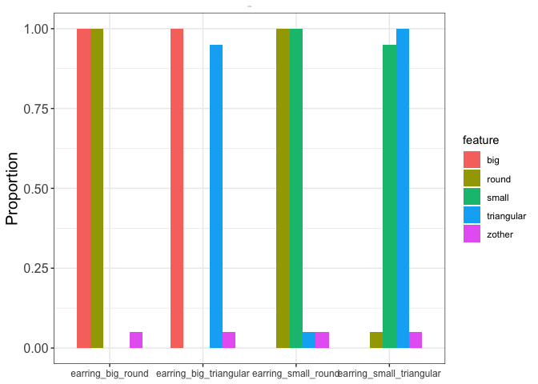<!-- -->

    ## `summarise()` regrouping output by 'img_name' (override with `.groups` argument)

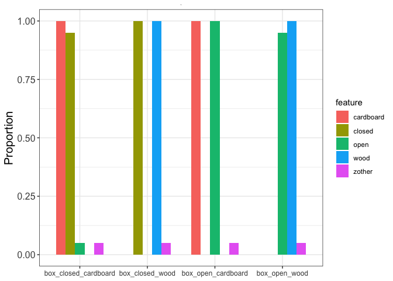<!-- -->

    ## `summarise()` regrouping output by 'img_name' (override with `.groups` argument)

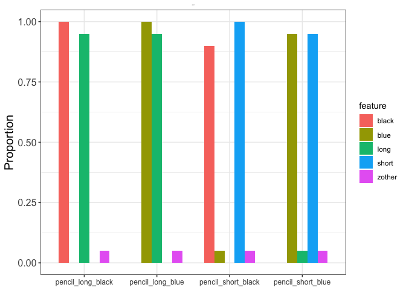<!-- -->

    ## `summarise()` regrouping output by 'img_name' (override with `.groups` argument)

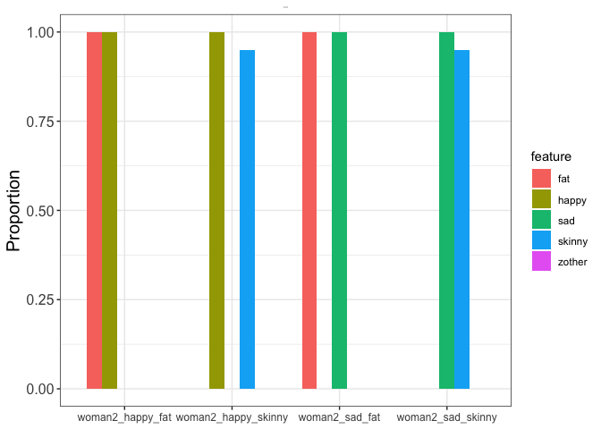<!-- -->

    ## `summarise()` regrouping output by 'img_name' (override with `.groups` argument)

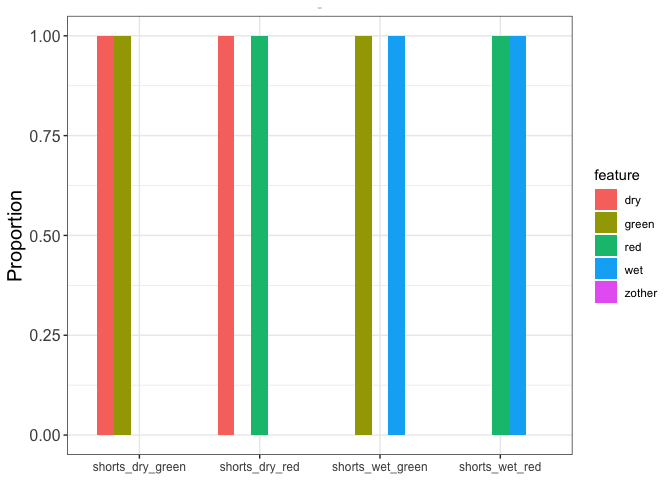<!-- -->

    ## `summarise()` regrouping output by 'img_name' (override with `.groups` argument)

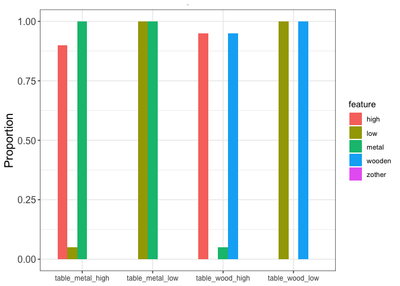<!-- -->

    ## `summarise()` regrouping output by 'img_name' (override with `.groups` argument)

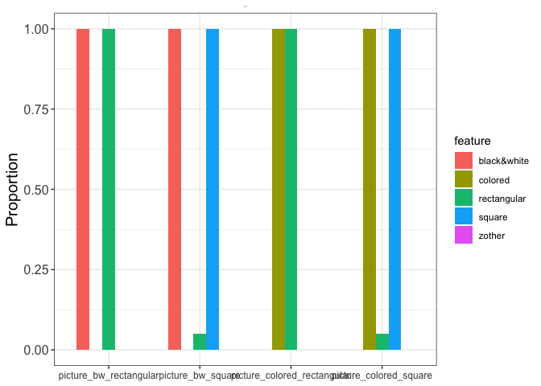<!-- -->

    ## `summarise()` regrouping output by 'img_name' (override with `.groups` argument)

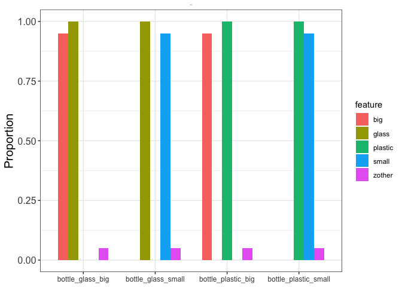<!-- -->

    ## `summarise()` regrouping output by 'img_name' (override with `.groups` argument)

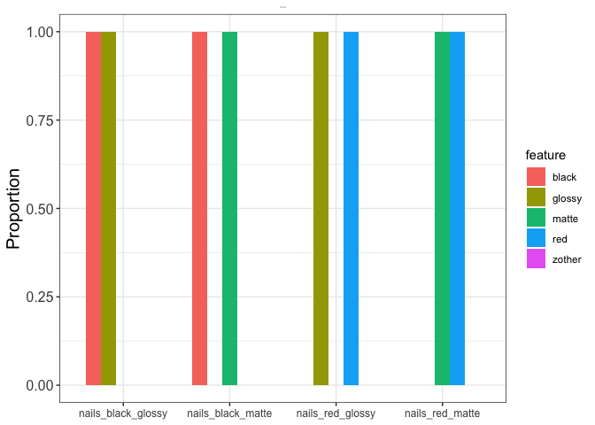<!-- -->

    ## `summarise()` regrouping output by 'img_name' (override with `.groups` argument)

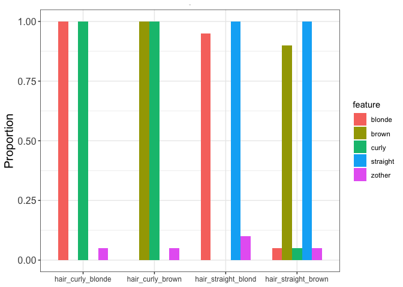<!-- -->
