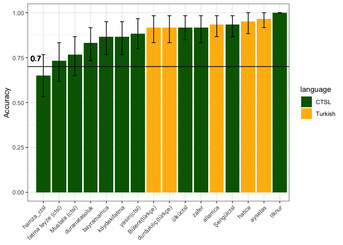
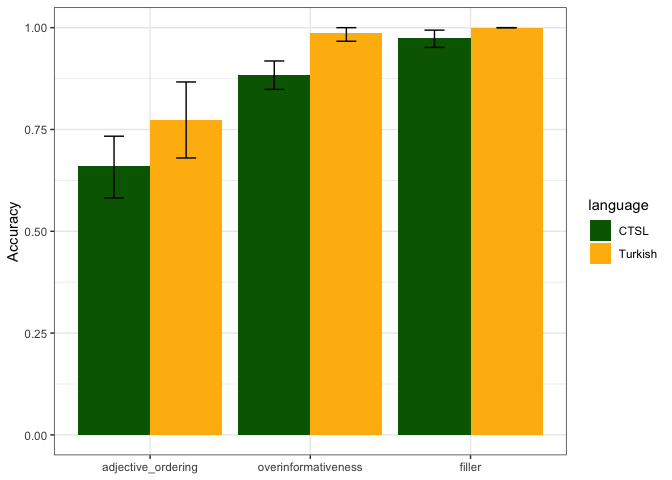
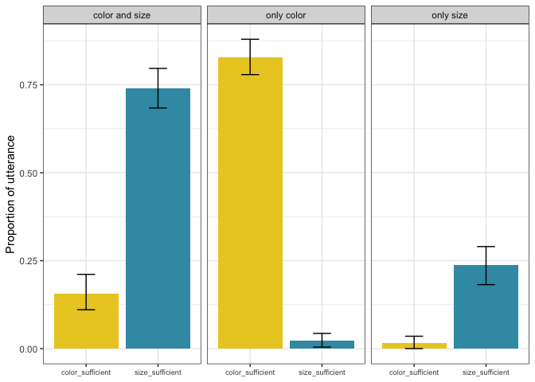
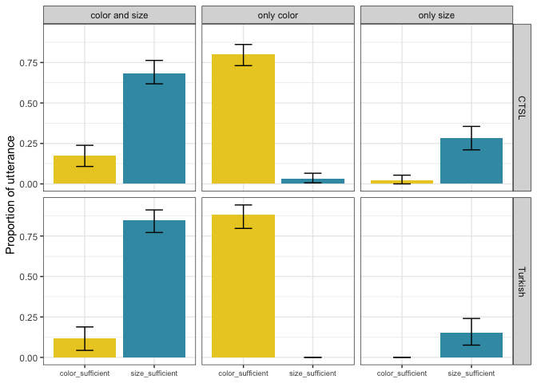
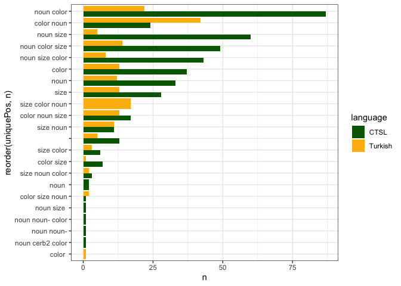
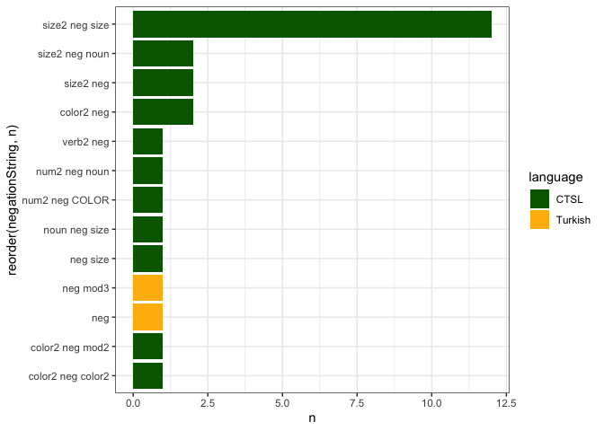

CTSL production experiment
================

**Number of participants, number of trials each participant completed:**

    ## [1] 16

    ##                     
    ##                      CTSL Turkish
    ##   aliamca               0      60
    ##   aysetas               0      60
    ##   bayramamca           60       0
    ##   Bülent(türkçe)        0      60
    ##   duranatasoluk        60       0
    ##   durdukılıç(türkçe)    0      60
    ##   fatma teyze (ctsl)   60       0
    ##   hamza_ctsl           60       0
    ##   hatice                0      60
    ##   Ilknur               60       0
    ##   köydekifatma         60       0
    ##   Mustafa (ctsl)       60       0
    ##   Şengülctsl           60       0
    ##   ülküctsl             60       0
    ##   yasin(ctsl)          60       0
    ##   zafer                60       0

**Overall
    accuracy:**

    ## `summarise()` regrouping output by 'speakerName' (override with `.groups` argument)

<!-- -->

**Accuracy by trial
    type:**

    ## `summarise()` regrouping output by 'language' (override with `.groups` argument)

<!-- -->

**Overinformativeness trials:**

    ##             
    ##               0  1
    ##   apple       0 16
    ##   bag         1 15
    ##   ball        0 16
    ##   balloon     1 11
    ##   baloon      0  4
    ##   brush       1 15
    ##   button      2 14
    ##   car         2 14
    ##   cat         2 14
    ##   chair       1 15
    ##   clock       3 13
    ##   dress       0 16
    ##   flower      3 13
    ##   glasses     3 13
    ##   glove       2 14
    ##   key         3 13
    ##   knife       0 16
    ##   lighter     1 15
    ##   lipstick    5 11
    ##   lock        1 15
    ##   pants       0 16
    ##   pepper      1 15
    ##   pot         1 15
    ##   scissors    1 15
    ##   shoe        0 13
    ##   show        0  3
    ##   skirt       1 15
    ##   socks       0 16
    ##   tie         1 15
    ##   toothbrush  1 15
    ##   tshirt      2 14
    ##   umbrella    1 15

**Was a color mentioned?**

    ## 
    ##   0   1 
    ##  86 394

**Was size mentioned?**

    ## 
    ##   0   1 
    ## 192 288

**Was both a color and size mentioned?**

    ## 
    ##   0   1 
    ## 264 216

**Was an object name mentioned?**

    ## 
    ##   0   1 
    ##  31 449

**In how many trials did the listener choose the right object?**

    ## 
    ##   0   1 
    ##  40 440

    ## [1] "percentage of trials where target wasn't selected:  8.33333333333333"

    ## [1] "distribution accross conditions: "

    ##                   
    ##                      0   1
    ##   color_sufficient  16 208
    ##   size_sufficient   24 232

**Exclude trials where target wasn’t selected**

    ## [1] 440

**Proportion of utterance by utterance type and trial
    type**

    ## `summarise()` regrouping output by 'RedundantProperty', 'condition' (override with `.groups` argument)

<!-- -->

**Proportion of utterance by language, utterance type and trial
    type**

    ## `summarise()` regrouping output by 'RedundantProperty', 'condition', 'MentionType' (override with `.groups` argument)

<!-- -->

**Proportion of utterance by utterance type and trial type - for each
participant**  
see graphs/by\_participant.pdf

**Order of constituents**  
see graphs/all\_constituents.pdf

**Order of unique constituents (only include first occurance of each
constituent)**  
see graphs/unique\_constituents.pdf

**Order of unique color, noun, size (remove all other constituents)**

    ## Warning: Unknown or uninitialised column: `uniqueItemized`.

    ## Warning: Unknown or uninitialised column: `uniquePos`.

<!-- -->

**Was negation used**  
Per attempt (not per trial)

    ## 
    ##   0   1 
    ## 582  27

**Word before negation & word after negation**  
<!-- -->

**Adjective ordering trials:**

    ##          
    ##            0  1
    ##   bottle   4 12
    ##   box      7  9
    ##   earring  5 11
    ##   frog     2 14
    ##   hair     3 13
    ##   man      7  9
    ##   man2     1 15
    ##   nails    8  8
    ##   pencil   3 13
    ##   picture  5 11
    ##   shorts   5 11
    ##   spoon    7  9
    ##   table    4 12
    ##   woman    4 12
    ##   woman2   8  8

**Best objects: frog, hair**  
man2 not included (need to fix
    typos\!\!)

    Warning: Expected 5 pieces. Missing pieces filled with `NA` in 236 rows [1, 2,
    3, 4, 5, 6, 7, 8, 9, 10, 11, 12, 13, 14, 15, 16, 17, 18, 19, 20, ...].

\[1\]
“FROG”

| language | targetName           | gloss                                              |
| :------- | :------------------- | :------------------------------------------------- |
| Turkish  | frog\_spotted\_red   | red spotted frog                                   |
| Turkish  | frog\_spotted\_green | green spotted frog                                 |
| CTSL     | frog\_spotted\_green | point(green) frog spotted frog spotted striped not |
| Turkish  | frog\_spotted\_green | green frog                                         |
| CTSL     | frog\_striped\_red   | frog point(red) striped point(red)                 |
| Turkish  | frog\_striped\_red   | frog red striped                                   |
| CTSL     | frog\_striped\_green | frog color frog                                    |
| CTSL     | frog\_spotted\_red   | spotted frog spotted                               |
| Turkish  | frog\_striped\_green | frog striped green                                 |
| CTSL     | frog\_spotted\_green | frog green spotted                                 |
| CTSL     | frog\_striped\_red   | frog ? frog red striped                            |
| CTSL     | frog\_striped\_green | point(green) color frog                            |
| CTSL     | frog\_spotted\_green | frog point(green) spotted                          |
| CTSL     | frog\_striped\_green | frog striped                                       |
| CTSL     | frog\_striped\_green | frog point(yellow)                                 |
| CTSL     | frog\_striped\_red   | frog red striped                                   |
| Turkish  | frog\_spotted\_red   | spot spot                                          |
| Turkish  | frog\_spotted\_green | spotted striped not                                |
| CTSL     | frog\_striped\_green | point(green)                                       |
| CTSL     | frog\_striped\_green | spotted not striped                                |

\[1\]
“HAIR”

| language | targetName            | gloss                                                                |
| :------- | :-------------------- | :------------------------------------------------------------------- |
| Turkish  | hair\_straight\_brown | straight hair black woman                                            |
| Turkish  | hair\_curly\_blonde   | yellow curly haired woman                                            |
| CTSL     | hair\_curly\_brown    | woman hair-curly color point(brown) hair-curly                       |
| Turkish  | hair\_straight\_brown | black haired woman                                                   |
| CTSL     | hair\_curly\_blonde   | hair-curly point(yellow) hair                                        |
| Turkish  | hair\_curly\_brown    | hair curly black                                                     |
| CTSL     | hair\_straight\_brown | hair head hair                                                       |
| CTSL     | hair\_straight\_blond | point(brown) hair-straight                                           |
| Turkish  | hair\_curly\_brown    | curly hair black                                                     |
| CTSL     | hair\_straight\_brown | hair black straight black straight                                   |
| CTSL     | hair\_curly\_blonde   | hair-blonde curly                                                    |
| CTSL     | hair\_straight\_blond | hair long point(yellow) curly not straight yellow point(yellow) hair |
| CTSL     | hair\_straight\_brown | hair-straight point(blue) straight                                   |
| CTSL     | hair\_curly\_brown    | hair curly-hair point(brown) curly-hair                              |
| CTSL     | hair\_straight\_blond | hair long-hair curly not straight                                    |
| CTSL     | hair\_curly\_blonde   | hair point(yellow)                                                   |
| Turkish  | hair\_straight\_brown | straight                                                             |
| CTSL     | hair\_straight\_brown | hair head straight                                                   |
| CTSL     | hair\_straight\_brown | black straight                                                       |
| CTSL     | hair\_straight\_blond | straight                                                             |
| CTSL     | hair\_straight\_blond | point(tan)                                                           |
| CTSL     | hair\_curly\_blonde   | curly                                                                |

**Worst objects: woman2, nails**  
\[1\]
“WOMAN2”

| language | targetName            | gloss                                                   |
| :------- | :-------------------- | :------------------------------------------------------ |
| Turkish  | woman2\_happy\_fat    | fattest woman ?                                         |
| Turkish  | woman2\_sad\_skinny   | very angry worried one woman                            |
| CTSL     | woman2\_happy\_fat    | double-chin fat double-chin waman old old               |
| Turkish  | woman2\_happy\_skinny | smiling woman                                           |
| CTSL     | woman2\_sad\_fat      | double-chin double-chin woman double-chin fat chin chin |
| Turkish  | woman2\_happy\_skinny | woman small smiling                                     |
| CTSL     | woman2\_sad\_fat      | old fat fat-sad                                         |
| CTSL     | woman2\_happy\_skinny | woman happy happy fat                                   |
| Turkish  | woman2\_sad\_skinny   | standing angry                                          |
| CTSL     | woman2\_happy\_skinny | woman smile chin no pretty ?                            |
| CTSL     | woman2\_sad\_skinny   | woman-sad sad point(screen)                             |
| CTSL     | woman2\_sad\_fat      | woman fat happy not sad                                 |
| CTSL     | woman2\_sad\_skinny   | old sad old                                             |
| CTSL     | woman2\_sad\_fat      | old fat old fat                                         |
| CTSL     | woman2\_sad\_skinny   | woman-sad skinny-sad woman six five                     |
| CTSL     | woman2\_happy\_fat    | old woman fat happy                                     |
| Turkish  | woman2\_happy\_fat    | fattest one smaller woman                               |
| Turkish  | woman2\_sad\_skinny   | very mm fat not                                         |
| Turkish  | woman2\_sad\_skinny   | younger one                                             |
| CTSL     | woman2\_sad\_fat      | fat                                                     |
| CTSL     | woman2\_sad\_skinny   | old-sad old                                             |
| CTSL     | woman2\_sad\_fat      | fat                                                     |
| CTSL     | woman2\_happy\_fat    | fat left fat happy                                      |
| Turkish  | woman2\_happy\_fat    | smiling woman                                           |
| Turkish  | woman2\_sad\_skinny   | yes                                                     |
| Turkish  | woman2\_sad\_skinny   | woman                                                   |
| CTSL     | woman2\_sad\_fat      | sad                                                     |
| CTSL     | woman2\_happy\_fat    | neg                                                     |
| Turkish  | woman2\_happy\_fat    | fattest smiling woman                                   |
| Turkish  | woman2\_sad\_skinny   | not smiling                                             |
| CTSL     | woman2\_happy\_fat    | fat                                                     |

\[1\]
“NAILS”

| language | targetName            | gloss                                                   |
| :------- | :-------------------- | :------------------------------------------------------ |
| Turkish  | woman2\_happy\_fat    | fattest woman ?                                         |
| Turkish  | woman2\_sad\_skinny   | very angry worried one woman                            |
| CTSL     | woman2\_happy\_fat    | double-chin fat double-chin waman old old               |
| Turkish  | woman2\_happy\_skinny | smiling woman                                           |
| CTSL     | woman2\_sad\_fat      | double-chin double-chin woman double-chin fat chin chin |
| Turkish  | woman2\_happy\_skinny | woman small smiling                                     |
| CTSL     | woman2\_sad\_fat      | old fat fat-sad                                         |
| CTSL     | woman2\_happy\_skinny | woman happy happy fat                                   |
| Turkish  | woman2\_sad\_skinny   | standing angry                                          |
| CTSL     | woman2\_happy\_skinny | woman smile chin no pretty ?                            |
| CTSL     | woman2\_sad\_skinny   | woman-sad sad point(screen)                             |
| CTSL     | woman2\_sad\_fat      | woman fat happy not sad                                 |
| CTSL     | woman2\_sad\_skinny   | old sad old                                             |
| CTSL     | woman2\_sad\_fat      | old fat old fat                                         |
| CTSL     | woman2\_sad\_skinny   | woman-sad skinny-sad woman six five                     |
| CTSL     | woman2\_happy\_fat    | old woman fat happy                                     |
| Turkish  | woman2\_happy\_fat    | fattest one smaller woman                               |
| Turkish  | woman2\_sad\_skinny   | very mm fat not                                         |
| Turkish  | woman2\_sad\_skinny   | younger one                                             |
| CTSL     | woman2\_sad\_fat      | fat                                                     |
| CTSL     | woman2\_sad\_skinny   | old-sad old                                             |
| CTSL     | woman2\_sad\_fat      | fat                                                     |
| CTSL     | woman2\_happy\_fat    | fat left fat happy                                      |
| Turkish  | woman2\_happy\_fat    | smiling woman                                           |
| Turkish  | woman2\_sad\_skinny   | yes                                                     |
| Turkish  | woman2\_sad\_skinny   | woman                                                   |
| CTSL     | woman2\_sad\_fat      | sad                                                     |
| CTSL     | woman2\_happy\_fat    | neg                                                     |
| Turkish  | woman2\_happy\_fat    | fattest smiling woman                                   |
| Turkish  | woman2\_sad\_skinny   | not smiling                                             |
| CTSL     | woman2\_happy\_fat    | fat                                                     |

**Next**  
\- Get cohort information from Rabia (facet all plots by cohort/age)  
\- Fix all typos (COLOR to clr, fix ?)  
\- Coding pos for adjective ordering trials  
\- Coding order of adjectives
