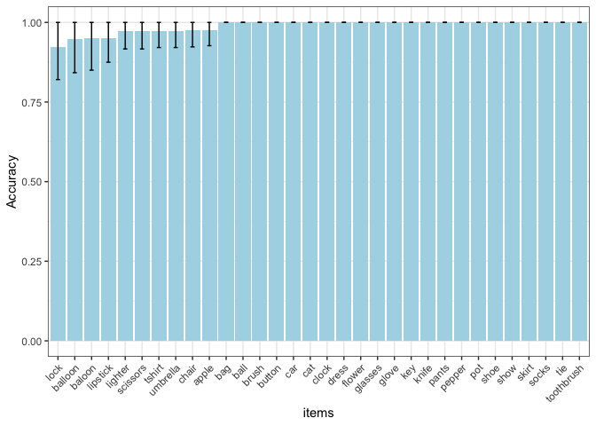

English production experiment
================

**Number of participants tested:**

    ## [1] 120

    ## 
    ## director  guesser 
    ##       52       68

**Number of unique gameids and number of rounds for each
    game**

    ## [1] 59

    ## `summarise()` ungrouping output (override with `.groups` argument)

    ## 
    ##  1  2  3  7  9 10 12 14 15 16 19 29 33 37 51 58 60 
    ##  2  1  1  1  2  1  1  1  1  1  1  1  1  1  1  1 41

**Exclusion: Remove games with non-native speakers: **

    ##   gameID
    ## 1 6833-4
    ## 2 8490-a
    ## 3 8424-1

**Overall
    accuracy:**

    ## `summarise()` ungrouping output (override with `.groups` argument)

<!-- -->

**Exclusion: Remove games with accuracy\<70%: **

    ## # A tibble: 10 x 7
    ##    gameid  Mean CILow CIHigh   YMin  YMax lowacc
    ##    <fct>  <dbl> <dbl>  <dbl>  <dbl> <dbl> <chr> 
    ##  1 0193-e 0.216 0.108  0.135 0.108  0.351 1     
    ##  2 2059-0 0     0      0     0      0     1     
    ##  3 2667-0 0.333 0.333  0.667 0      1     1     
    ##  4 4966-c 0.35  0.117  0.117 0.233  0.467 1     
    ##  5 5051-7 0.633 0.117  0.117 0.517  0.75  1     
    ##  6 6441-1 0.35  0.117  0.117 0.233  0.467 1     
    ##  7 7185-4 0.143 0.143  0.286 0      0.429 1     
    ##  8 7298-3 0     0      0     0      0     1     
    ##  9 7742-e 0.241 0.138  0.172 0.103  0.414 1     
    ## 10 8347-d 0.25  0.188  0.25  0.0625 0.5   1

    ## [1] 46

**Accuracy by trial
    type:**

    ## `summarise()` ungrouping output (override with `.groups` argument)

<!-- -->

# Redundant modifier trials:

    ## `summarise()` ungrouping output (override with `.groups` argument)

<!-- -->

**Was a color mentioned?**

    ## 
    ##   0   1 
    ## 367 779

**Was size mentioned?**

    ## 
    ##   0   1 
    ## 688 458

**Was both a color and size mentioned?**

    ## 
    ##   0   1 
    ## 914 232

**Was an object name mentioned?** TODO: Fix this (this is not true\!)

    ## 
    ##    1 
    ## 1146

**In how many trials did the listener choose the right object?**

    ## 
    ##    0    1 
    ##   13 1133

    ## [1] "percentage of trials where target wasn't selected:  1.13438045375218"

    ## [1] "distribution accross conditions: "

    ##                   
    ##                      0   1
    ##   color_sufficient   9 522
    ##   none               0   0
    ##   size_sufficient    4 611

**Exclude trials where target wasn’t selected**

    ## [1] 1133

**Reading corrected dataset for typos and mention of other modifiers**
TODO: manual correction + code ‘other’ modifiers

**Proportion of utterance by utterance type and trial
    type**

    ## `summarise()` regrouping output by 'RedundantProperty', 'condition' (override with `.groups` argument)

<!-- -->

    ## Loading required package: Matrix

    ## 
    ## Attaching package: 'Matrix'

    ## The following objects are masked from 'package:tidyr':
    ## 
    ##     expand, pack, unpack

    ## Generalized linear mixed model fit by maximum likelihood (Laplace
    ##   Approximation) [glmerMod]
    ##  Family: binomial  ( logit )
    ## Formula: redundant ~ ccondition + (1 + ccondition | gameid) + (1 | targetName)
    ##    Data: tomodel
    ## 
    ##      AIC      BIC   logLik deviance df.resid 
    ##    632.7    662.2   -310.4    620.7      992 
    ## 
    ## Scaled residuals: 
    ##     Min      1Q  Median      3Q     Max 
    ## -2.2989 -0.2233 -0.0521 -0.0412  4.4268 
    ## 
    ## Random effects:
    ##  Groups     Name        Variance Std.Dev. Corr
    ##  targetName (Intercept) 1.165    1.079        
    ##  gameid     (Intercept) 1.982    1.408        
    ##             ccondition  9.814    3.133    0.40
    ## Number of obs: 998, groups:  targetName, 119; gameid, 45
    ## 
    ## Fixed effects:
    ##             Estimate Std. Error z value Pr(>|z|)    
    ## (Intercept)  -3.2650     0.5564  -5.868 4.40e-09 ***
    ## ccondition    4.9202     1.1613   4.237 2.27e-05 ***
    ## ---
    ## Signif. codes:  0 '***' 0.001 '**' 0.01 '*' 0.05 '.' 0.1 ' ' 1
    ## 
    ## Correlation of Fixed Effects:
    ##            (Intr)
    ## ccondition -0.682

**Proportion of utterance
    type**

    ## `summarise()` regrouping output by 'RedundantProperty', 'ThreeType' (override with `.groups` argument)

<!-- -->

**Was negation used**  
Per attempt (not per trial)

    ## 
    ##    0    1 
    ## 1131   15

**Speaker messages that include
    negation**

    ##  [1] there's no image selected so I don't know                                                                                                       
    ##  [2] red lipstick, not the pink                                                                                                                      
    ##  [3] it is not white                                                                                                                                 
    ##  [4] Not the same as the others___yes                                                                                                                
    ##  [5] no object                                                                                                                                       
    ##  [6] pink, not red                                                                                                                                   
    ##  [7] sorry they are loading one sec___ok glad it isn't just me. yeah i see one pink one___still nothing else here, i would just pick it at this point
    ##  [8] impossible to tell if it is not loaded or intentional so we can't do anything else___blue                                                       
    ##  [9] ugh the one highlighted is not loaded___there it is, the big one                                                                                
    ## [10] nothing                                                                                                                                         
    ## [11] One of these is not like the other                                                                                                              
    ## [12] One of these is not the same color as the others                                                                                                
    ## [13] nothing in my square                                                                                                                            
    ## [14] not a balloon                                                                                                                                   
    ## [15] red not pink                                                                                                                                    
    ## 1426 Levels:   The chick is the target ;) ___extra large 1 1st ... Youngest with facial hair

# Modifier ordering trials:

    ## `summarise()` ungrouping output (override with `.groups` argument)

<!-- -->

**Best objects: earring,
pencil**

| targetName                 | speakerMessages                                   |
| :------------------------- | :------------------------------------------------ |
| earring\_big\_round        | large circle earring                              |
| earring\_small\_triangular | small triangle earrings                           |
| earring\_big\_round        | round and big earings                             |
| earring\_big\_triangular   | large triangle earring                            |
| earring\_big\_triangular   | large triangle earring                            |
| earring\_big\_round        | large circular earing                             |
| earring\_big\_triangular   | large triangle                                    |
| earring\_big\_triangular   | It is bigger and not a circle                     |
| earring\_big\_round        | big circle                                        |
| earring\_small\_triangular | smaller, has angles                               |
| earring\_big\_round        | larger round                                      |
| earring\_big\_round        |                                                   |
| earring\_big\_round        | The object is big and round.                      |
| earring\_small\_triangular | small tri                                         |
| earring\_small\_triangular | small triangle                                    |
| earring\_small\_triangular | small triangle                                    |
| earring\_small\_round      | small round                                       |
| earring\_big\_triangular   | large triangle earring                            |
| earring\_small\_round      | small and round                                   |
| earring\_small\_triangular | smallest triangle                                 |
| earring\_small\_triangular | human\_\_\_small triangle                         |
| earring\_big\_triangular   | triangle thats big                                |
| earring\_big\_triangular   | big triangle earring                              |
| earring\_small\_triangular | small triangle                                    |
| earring\_small\_round      | The object is round and small                     |
| earring\_big\_triangular   | big rectangle\_\_\_sry                            |
| earring\_big\_triangular   | The largest triangle                              |
| earring\_small\_triangular | SMALL TRIANGLE                                    |
| earring\_small\_round      | small circle                                      |
| earring\_big\_triangular   | large triangle                                    |
| earring\_small\_triangular | The smaller triangular ear ring                   |
| earring\_big\_round        | round big                                         |
| earring\_big\_triangular   | biggest triangle                                  |
| earring\_small\_round      | small oval                                        |
| earring\_small\_round      | small circle                                      |
| earring\_big\_triangular   | a large diamond shape earring\_\_\_sorry triangle |
| earring\_small\_round      | small round                                       |
| earring\_small\_round      | small, round                                      |
| earring\_big\_triangular   | big triangle                                      |
| earring\_big\_round        | biggest round earing                              |

| targetName           | speakerMessages              |
| :------------------- | :--------------------------- |
| pencil\_short\_blue  | half blue pencil             |
| pencil\_long\_blue   | large blue pencil            |
| pencil\_long\_blue   | blue big                     |
| pencil\_long\_black  | big, black                   |
| pencil\_long\_black  | large black pencil           |
| pencil\_long\_black  | longest black pencil         |
| pencil\_short\_black | smallest black               |
| pencil\_short\_blue  | smaller blue                 |
| pencil\_short\_blue  | small blue                   |
| pencil\_short\_blue  | smallest, blue               |
| pencil\_short\_blue  | small blue                   |
| pencil\_long\_black  | long and black               |
| pencil\_short\_black | short black                  |
| pencil\_short\_blue  | small blue                   |
| pencil\_long\_black  | big black                    |
| pencil\_long\_black  | black large                  |
| pencil\_short\_black | small black pencil           |
| pencil\_long\_blue   | long and blue                |
| pencil\_short\_black | smallest black               |
| pencil\_short\_blue  | short blue                   |
| pencil\_short\_black | smallest                     |
| pencil\_short\_blue  | small blue                   |
| pencil\_long\_blue   | The object is large and blue |
| pencil\_long\_blue   | big blue                     |
| pencil\_short\_blue  | Small and not black          |
| pencil\_long\_black  | BIG BLACK PENCIL             |
| pencil\_short\_blue  | small blue                   |
| pencil\_long\_black  | large black                  |
| pencil\_long\_black  | The black long pencil        |
| pencil\_short\_black | black small                  |
| pencil\_short\_blue  | small blue                   |
| pencil\_long\_blue   | large blue                   |
| pencil\_long\_blue   | large blue                   |
| pencil\_long\_black  | it’s longer and black        |
| pencil\_long\_black  | big black                    |
| pencil\_short\_blue  | short blue                   |
| pencil\_long\_black  | big black                    |
| pencil\_short\_blue  | small and blue               |

**Worst objects: spoon,
hair**

| targetName           | speakerMessages                                                |
| :------------------- | :------------------------------------------------------------- |
| spoon\_wooden\_dirty | wood spoon with spotted pattern on top                         |
| spoon\_metal\_dirty  | shiny silver spoon with food                                   |
| spoon\_wooden\_clean | rusted but clean                                               |
| spoon\_metal\_dirty  | semi dirty, clean handle                                       |
| spoon\_wooden\_clean | clean wooden spoon                                             |
| spoon\_metal\_dirty  | silver spoon, no peanut butter on handle, peanut putter on top |
| spoon\_metal\_clean  | very shiny without markings                                    |
| spoon\_metal\_clean  | clean silver                                                   |
| spoon\_wooden\_clean | most rust                                                      |
| spoon\_wooden\_clean | wood texture, looks like it’s clean                            |
| spoon\_wooden\_clean | looks completely wooden but with less distortion               |
| spoon\_wooden\_dirty | darkest round part of the spoon.                               |
| spoon\_metal\_clean  | shiny                                                          |
| spoon\_metal\_dirty  | the dirty silver one                                           |
| spoon\_wooden\_dirty | too much shade\_\_\_silver MIXED WOOD                          |
| spoon\_wooden\_dirty | very very old                                                  |
| spoon\_wooden\_dirty | dirty wood spoon\_\_\_dark brown spoon head                    |
| spoon\_wooden\_dirty | dirty wooden                                                   |
| spoon\_wooden\_clean | wooden smallest                                                |
| spoon\_wooden\_clean | brownish spoon less rust                                       |
| spoon\_wooden\_dirty | rotted wood                                                    |
| spoon\_wooden\_dirty | dirty wooden spoon                                             |
| spoon\_metal\_dirty  | The obect is dirty and silver                                  |
| spoon\_metal\_dirty  | silver spoon with some dirt                                    |
| spoon\_metal\_dirty  | Only one where the actual scoop is painted                     |
| spoon\_wooden\_dirty | UN-CLEANED WOODEN                                              |
| spoon\_metal\_clean  | shiniest                                                       |
| spoon\_wooden\_dirty | rusty                                                          |
| spoon\_wooden\_clean | the clean wooded spoon                                         |
| spoon\_metal\_clean  | no peanut                                                      |
| spoon\_metal\_clean  | silver clean                                                   |
| spoon\_metal\_dirty  | clean handle, dirty top                                        |
| spoon\_wooden\_dirty | it’s multi-color and the darkest of them all                   |
| spoon\_metal\_dirty  | 2nd spoon\_\_\_slver                                           |
| spoon\_metal\_clean  | red                                                            |
| spoon\_wooden\_clean | smooth wood                                                    |
| spoon\_wooden\_dirty | dirtiest                                                       |

| targetName            | speakerMessages                |
| :-------------------- | :----------------------------- |
| hair\_straight\_brown | straight brown hair            |
| hair\_straight\_blond | long strait blond              |
| hair\_curly\_blonde   | curly white                    |
| hair\_curly\_blonde   | curly blonde hair              |
| hair\_straight\_brown | long brown hair, straight      |
| hair\_curly\_brown    | brown, curly                   |
| hair\_curly\_brown    | curly brown hair               |
| hair\_curly\_brown    | curling black                  |
| hair\_curly\_brown    | curly, brown                   |
| hair\_straight\_blond | blond straight                 |
| hair\_straight\_brown | brown and straight             |
| hair\_straight\_blond | straight light                 |
| hair\_straight\_blond | straight blonde                |
| hair\_curly\_brown    | black curly                    |
| hair\_curly\_brown    | brown curly                    |
| hair\_straight\_blond | straight blonde hair           |
| hair\_straight\_brown | straight brown                 |
| hair\_curly\_blonde   | blond curly                    |
| hair\_curly\_blonde   | curly blonde                   |
| hair\_curly\_brown    | the target is curly and brown  |
| hair\_curly\_brown    | brown curly hair               |
| hair\_curly\_blonde   | The object is bright and curly |
| hair\_straight\_brown | brown stright                  |
| hair\_curly\_brown    | Dark and curly                 |
| hair\_straight\_brown | BLACK SOLID HAIR               |
| hair\_curly\_blonde   | curly blonde                   |
| hair\_curly\_blonde   | curly blonde                   |
| hair\_curly\_blonde   | curly blonde hair              |
| hair\_curly\_brown    | The bdark wavy hair            |
| hair\_straight\_blond | beige straight                 |
| hair\_curly\_blonde   | curley blonde                  |
| hair\_curly\_brown    | brown curly                    |
| hair\_curly\_brown    | dark curly                     |
| hair\_straight\_brown | She has straight dark hair     |
| hair\_straight\_brown | long straight brown            |
| hair\_curly\_blonde   | blonde, curly                  |
| hair\_curly\_blonde   | curly blonde                   |
| hair\_curly\_blonde   | blonde and wavy                |
